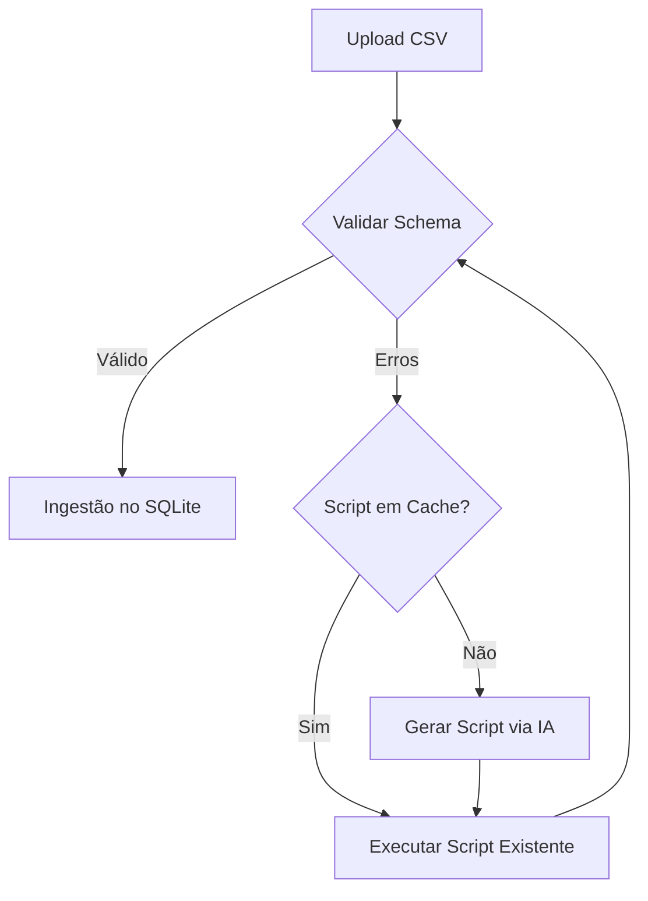

# 🚀 Smart CSV Ingestor & Validator (AI-Powered)


> **Desafio Técnico de Engenharia de Dados:** Pipeline inteligente de ingestão de dados financeiros com validação automática e correção de erros assistida por Inteligência Artificial Generativa.

---

## 📋 Sobre o Projeto

Este projeto resolve um problema clássico de Engenharia de Dados: receber arquivos de diversas fontes (bancos, sistemas legados) com formatações inconsistentes e ingeri-los em um banco de dados padronizado.

Diferente de uma abordagem tradicional de ETL "hardcoded", esta solução utiliza **IA Generativa (LLMs)** para criar scripts de correção dinamicamente, aprendendo com os erros e reutilizando soluções para arquivos similares no futuro.

### 🎯 O Problema Resolvido
Arquivos CSV financeiros frequentemente chegam com:
* Encodings quebrados (UTF-8 vs Latin-1).
* Delimitadores incorretos (vírgula vs ponto-e-vírgula).
* Formatos de data variados (DD/MM/AAAA vs AAAA-MM-DD).
* Valores monetários com formatação brasileira (R$ 1.200,50).

### 💡 A Solução
Uma aplicação web (Streamlit) que:
1.  Recebe o upload do arquivo.
2.  Valida contra um schema JSON rigoroso.
3.  Se houver erros, envia um relatório para a IA (Gemini).
4.  A IA gera um script Python de correção (Sanitization).
5.  O sistema valida, executa e salva o script para uso futuro (Cache Inteligente).

---

## 🏗️ Arquitetura da Solução

O fluxo de dados segue o seguinte pipeline:



## 🛠️ Tecnologias Utilizadas
* Linguagem: Python

* Interface: Streamlit

* Manipulação de Dados: Pandas

* IA Generativa: Google Gemini API (google-generativeai)

* Banco de Dados: SQLite

* Encoding: Chardet

* Testes: Pytest

## 📂 Estrutura do Projeto

```
desafio-franq/
├── app/                  # Código da Interface (Streamlit)
│   ├── main.py           # Ponto de entrada da aplicação
│   └── components/       # Componentes visuais
├── src/                  # Lógica de Negócio (Core)
│   ├── validation.py     # Funções de validação de dados
│   ├── ai_handler.py     # Integração com a API do Gemini
│   └── db_handler.py     # Persistência e cache de scripts
├── database/             # Camada de Dados
│   ├── schema.sql        # Estrutura das tabelas
│   └── template.json     # Contrato de dados (Schema esperado)
├── data/                 # Arquivos locais (ignorado no git)
├── tests/                # Testes automatizados
├── requirements.txt      # Dependências do projeto
└── README.md             # Documentação
```

## 🚀 Como Executar Localmente
### Pré-requisitos
Python 3.10 ou superior.

Uma chave de API do Google Gemini (gratuita no Google AI Studio).
### Passo a Passo

## 1. Clone o repositório:
```
git clone [https://github.com/GPetrolini/desafio-estagio-engenharia.git](https://github.com/GPetrolini/desafio-franq.git)
cd desafio-estagio-engenharia
```
## 2 Crie e ative o ambiente virtual:
```
# Linux/Mac/WSL
python3 -m venv venv
source venv/bin/activate

# Windows (Powershell)
python -m venv venv
.\venv\Scripts\Activate
```
## 3 Instale as dependências:
```
pip install -r requirements.txt
```
## 4 Configure as Variáveis de Ambiente:
Crie um arquivo .env na raiz do projeto e adicione sua chave:
```
GEMINI_API_KEY="sua_chave_aqui"
```
## 5 Inicialize o banco de dados:
```
python init_db.py
```
## 6 Execute a aplicação
```
streamlit run app/main.py
```
# Testes
O projeto inclui testes unitários para garantir a qualidade da validação de dados.
```
pytest tests/ -v
```

👤 Autor
Gustavo Petrolini

💼 [LinkedIn](https://www.linkedin.com/in/gustavo-petrolini-885080213/)

🐙 [GitHub](https://github.com/GPetrolini)