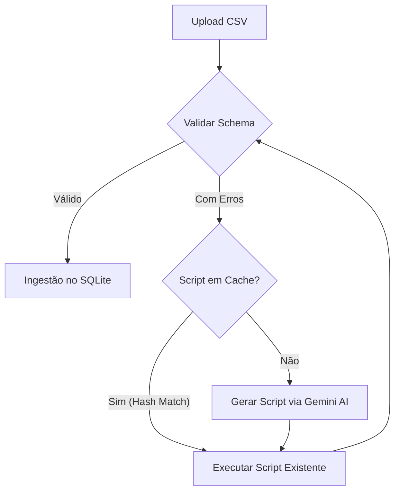

# 🚀 Smart CSV Ingestor & Validator (AI-Powered)


> **Desafio Técnico de Engenharia de Dados:** Pipeline inteligente de ingestão de dados financeiros com validação automática, cache de scripts e correção de erros assistida por Inteligência Artificial Generativa.

---

## 📋 Contexto do Projeto

Este projeto foi desenvolvido como solução para um desafio de Engenharia de Dados focado em automação de ingestão. O cenário envolve o recebimento de arquivos CSV de múltiplas fontes (bancos, sistemas legados, parceiros) que não seguem um padrão estrito, apresentando problemas como:

* **Encodings quebrados** (UTF-8 vs Latin-1).
* **Delimitadores incorretos** (vírgula vs ponto-e-vírgula).
* **Formatos de data variados** (DD/MM/AAAA vs ISO 8601).
* **Valores monetários não padronizados** (R$ 1.200,50 vs 1200.50).
* **Nomes de colunas inconsistentes** (`data` vs `data_transacao`).

### 🎯 A Missão
Criar um sistema "resiliente" que não apenas valide os dados contra um schema rigoroso, mas utilize **IA Generativa (LLM)** para corrigir os arquivos automaticamente, aprendendo com o processo para otimizar ingestões futuras.

---

## 💡 Solução e Diferenciais

A solução consiste em uma aplicação web interativa que orquestra todo o ciclo de vida do dado.

### ✅ Funcionalidades Principais
1.  **Validação Rigorosa:** Implementação de regras de negócio estritas (Schema Check, Enums, Tipagem) baseadas no `template.json`.
2.  **Motor de Correção via IA:** Integração com o **Google Gemini 2.5 Flash** para gerar scripts de sanitização (`pandas`) sob demanda para arquivos problemáticos.
3.  **Cache Inteligente (Smart Replay):** Scripts gerados pela IA são hasheados e salvos no banco SQLite. Se um arquivo com estrutura similar for enviado novamente, o sistema reutiliza a solução instantaneamente, economizando tokens e tempo.
4.  **Ingestão Transaction-Safe:** Os dados só entram na tabela final (`transacoes_financeiras`) após passarem por limpeza e tipagem estrita, garantindo a integridade do banco (Zero `NaN` em campos chave).

### 🌟 Bônus Implementados (Diferenciais)
* [x] **Métricas de Uso:** Dashboard lateral com estatísticas em tempo real (Total processado, Eficiência do Cache vs IA).
* [x] **Logs Detalhados:** Auditoria completa de cada operação na tabela `log_ingestao`.
* [x] **Engenharia de Prompt Avançada:** Feedback loop robusto onde a IA recebe o schema alvo e os erros exatos para gerar código preciso.

---

## 🏗️ Arquitetura do Pipeline

O fluxo de dados segue um padrão de "Human-in-the-loop" com automação progressiva:



## 🛠️ Tecnologias Utilizadas


## 📂 Estrutura do Projeto

```
desafio-franq/
├── app/                  # Código da Interface (Streamlit)
│   ├── main.py           # Ponto de entrada da aplicação
│   └── components/       # Componentes visuais
├── src/                  # Lógica de Negócio (Core)
│   ├── validation.py     # Funções de validação de dados
│   ├── ai_handler.py     # Integração com a API do Gemini
│   └── db_handler.py     # Persistência e cache de scripts
├── database/             # Camada de Dados
│   ├── schema.sql        # Estrutura das tabelas
│   └── template.json     # Contrato de dados (Schema esperado)
├── data/                 # Arquivos locais (ignorado no git)
├── tests/                # Testes automatizados
├── requirements.txt      # Dependências do projeto
└── README.md             # Documentação
```

## 🚀 Como Executar Localmente
### Pré-requisitos
Python 3.10 ou superior.

Uma chave de API do Google Gemini (gratuita no Google AI Studio).
### Passo a Passo

## 1. Clone o repositório:
```
git clone [https://github.com/GPetrolini/desafio-estagio-engenharia.git](https://github.com/GPetrolini/desafio-franq.git)
cd desafio-estagio-engenharia
```
## 2 Crie e ative o ambiente virtual:
```
# Linux/Mac/WSL
python3 -m venv venv
source venv/bin/activate

# Windows (Powershell)
python -m venv venv
.\venv\Scripts\Activate
```
## 3 Instale as dependências:
```
pip install -r requirements.txt
```
## 4 Configure as Variáveis de Ambiente:
Crie um arquivo .env na raiz do projeto e adicione sua chave:
```
GEMINI_API_KEY="sua_chave_aqui"
```
## 5 Inicialize o banco de dados:
```
python init_db.py
```
## 6 Execute a aplicação
```
streamlit run app/main.py
```
# Testes
O projeto inclui uma suíte de testes robusta (pytest) que valida se o motor de detecção de erros está funcionando corretamente para todos os cenários de borda (arquivos corrompidos, colunas faltando, encoding errado).
```
pytest tests/ -v
```

👤 Autor
Gustavo Petrolini

💼 [LinkedIn](https://www.linkedin.com/in/gustavo-petrolini-885080213/)

🐙 [GitHub](https://github.com/GPetrolini)


Projeto desenvolvido como parte de processo seletivo para estágio em Dados na Franq Open Banking.